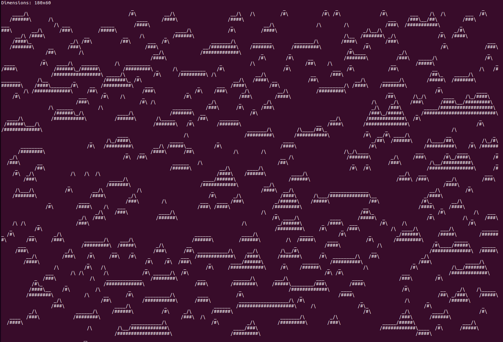

# Wave Function Collapse
In ascii... with spaghetti... cooked very slow...

<p float="center">
  
</p>

## Features
Not many. Currently generates hilly map with defined size and given seed. The map modularity is not really implemented, but weight can be adjusted in-code to specify "biomes". There is no backtracking if the algo gets stuck in an impossible situation (doesn't happen so often though).

## Usage
Requires rust to be installed. Then use `cargo run --release` to run or `cargo build --release` to build.

Other options:
```
asciicollapse 0.1.0

USAGE:
    asciicollapse [OPTIONS]

OPTIONS:
    -h, --height <HEIGHT>    Height of the map [default: 10]
        --help               Print help information
    -s, --seed <SEED>        Random seed
    -V, --version            Print version information
    -w, --width <WIDTH>      Width of the map [default: 80]
```
